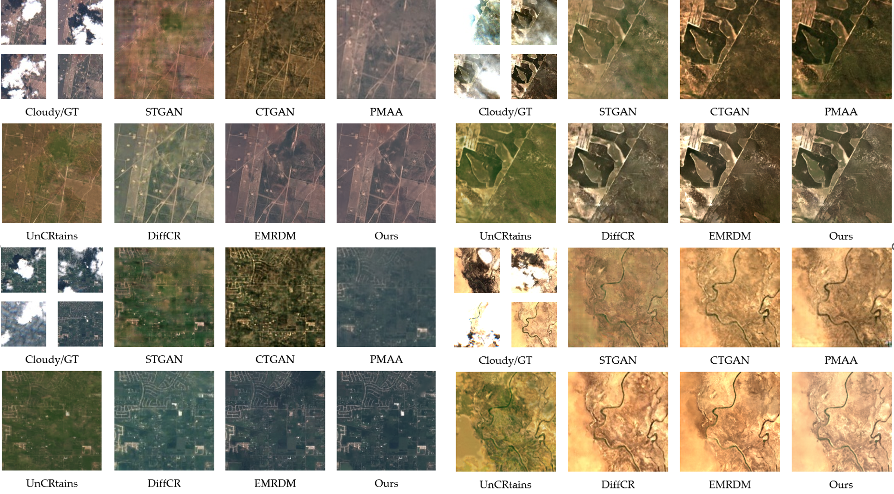

<div align="center">
<h1 align="center">DiffCR: A Fast Conditional Diffusion Framework for Cloud Removal from Optical Satellite Images</h1>



</div>

This is the official reposity of PCRDiff (Perlin Noise-Based Cloud Removal Diffusion Model), a novel diffusion framework for removing cloud occlusion from remote sensing images. Unlike traditional diffusion models that rely on Gaussian noise, PCRDiff leverages Perlin noise—a gradient noise that generates spatially smooth, continuous, and multi-scale patterns—to better simulate real cloud morphology. The model introduces a Perlin noise quantizer, a multi-attention fusion backbone, and an iterative denoising pipeline that achieves high-quality cloud-free reconstruction in a single sampling step. Extensive experiments on Sen2_MTC datasets demonstrate superior performance across multiple metrics.

## Requirements

To install dependencies:

```bash
pip install -r requirements.txt
```

<!-- >📋  Describe how to set up the environment, e.g. pip/conda/docker commands, download datasets, etc... -->

To download datasets:

- Sen2_MTC_Old: [multipleImage.tar.gz](https://doi.org/10.7910/DVN/BSETKZ)

- Sen2_MTC_New: [CTGAN.zip](https://drive.google.com/file/d/1-hDX9ezWZI2OtiaGbE8RrKJkN1X-ZO1P/view?usp=share_link)

To download weights:

- PCRDiff weights: [google drive](https://drive.google.com/drive/folders/1QUcKiE3ZtdCFBK0t9SxR831FsjxNRQ60?usp=drive_link) and [baidunetdisk](https://pan.baidu.com/s/1tqJY45m7KiL2ieJOiTk2BA?pwd=s3xp)

## Training

To train the models in the paper, run these commands:

```bash
python run.py -p train -c config/ours_perlin.json
```
for Sen2_MTC_New dataset and

```bash
python run.py -p train -c config/ours_perlin_old.json
```
for Sen2_MTC_Old dataset

<!-- >📋  Describe how to train the models, with example commands on how to train the models in your paper, including the full training procedure and appropriate hyperparameters. -->

## Testing

To test the pre-trained models in the paper, run these commands:

```bash
python run.py -p test -c config/ours_perlin.json
```

for Sen2_MTC_New dataset and

```bash
python run.py -p test -c config/ours_perlin_old.json
```
for Sen2_MTC_Old dataset

## Evaluation

To evaluate our models on two datasets, run:

```bash
python eval.py --path [path to experiment's path]
```


